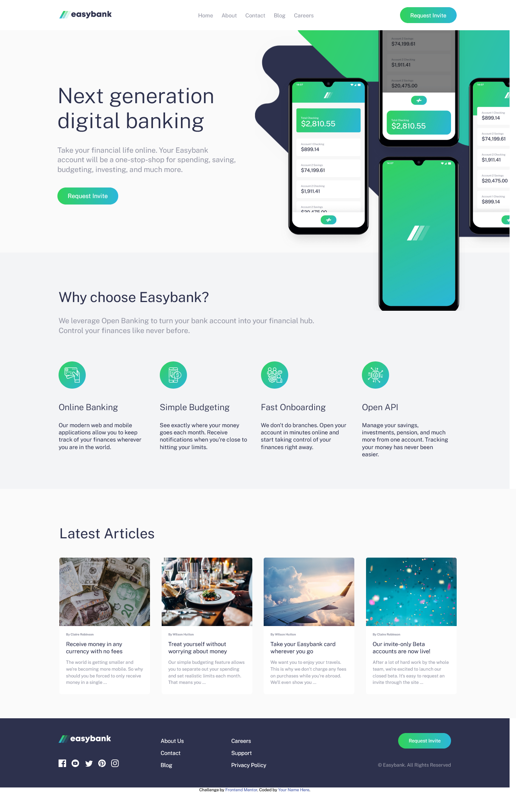

# Frontend Mentor - Easybank landing page solution

This is a solution to the [Easybank landing page challenge on Frontend Mentor](https://www.frontendmentor.io/challenges/easybank-landing-page-WaUhkoDN). Frontend Mentor challenges help you improve your coding skills by building realistic projects. 

## Table of contents

- [Overview](#overview)
  - [The challenge](#the-challenge)
  - [Screenshot](#screenshot)
  - [Links](#links)
- [My process](#my-process)
  - [Built with](#built-with)
  - [What I learned](#what-i-learned)
  - [Useful resources](#useful-resources)
- [Author](#author)

**Note: Delete this note and update the table of contents based on what sections you keep.**

## Overview

### The challenge

Users should be able to:

- View the optimal layout for the site depending on their device's screen size
- See hover states for all interactive elements on the page

### Screenshot



### Links

- Live Site URL: [https://julfinch.github.io/Easybank/](https://julfinch.github.io/Easybank/)

- Solution URL: [Add solution URL here](https://your-solution-url.com)


## My process

1. Built the '<nav>' with the links and request invite button inside it.
2. Came next is the hero section which I put inside the '<header>' where I created 2 equal flexboxes, the left and the right. The left flexbox is for the text content and the right is for both the ==bg-intro-desktop.png== and ==image-mockups.png==.
3. After that is the **Features Section** where I used CSS Grid to create 4 equal grid for each features of Easybank.
4. Next is the **Articles Section** where I used the same CSS Grid to the 4 articles.
5. Lastly is the '<footer>' where I also used CSS Grid to create 5 boxes of different sizes a seen in ==desktop-design.png==.
6. After the web layout, I focused next to its mobile responsiveness for 4 different media widths.
7. As for the hamburger menu, I used Vanilla Javascript to control its appearance and disappearance.

### Built with

- Semantic HTML5 markup
- CSS custom properties
- Flexbox
- CSS Grid
- Vanilla Javascript

### What I learned

This is my first project where I was able to solve how to program a hamburger menu using Vanilla Javascript. I am proud of this project because I am finally confident how to write a simple HTML DOM for click events as shown below:

```js
const openBtn = document.getElementById("open-menu-btn");
const closeBtn = document.getElementById("close-menu-btn");
const menuItem = document.querySelector(".nav-menu");
const gradientBg = document.getElementById("header-gradient");

openBtn.addEventListener("click", () => {
    menuItem.style.display = "block";
    openBtn.style.display = "none";
    closeBtn.style.display = "inline-block";
    gradientBg.style.display = "block";
});

const closeNav = () => {
    menuItem.style.display = "none";
    openBtn.style.display = "inline-block";
    closeBtn.style.display = "none";
    gradientBg.style.display = "none";
}
closeBtn.addEventListener("click", closeNav);
gradientBg.addEventListener("click", closeNav);
```

---

I also learned in this project on how to manipulate an SVG file to change its color upon hovering the mouse above it. I can also change some of the colors of its design thanks to the resources I found on the internet. I attached the links for that undder *Useful Resources*.

### Useful resources

- [CSS Filter Generator for Social Meida SVG Icons](https://codepen.io/sosuke/pen/Pjoqqp) - This helped me to convert the footer social media icons from originally white colored to green during hover effect. This uses the filter properties only to achieve the desired color.
- [Changing the bank name's dark-blue color to white without affecting the colors of other elements in the logo ](https://stackoverflow.com/a/50213445) - This is an amazing link that gave me an idea on how to change the colors of some parts of a logo without affecting the others.

## Author

- Frontend Mentor - [@julfinch](https://www.frontendmentor.io/profile/julfinch)
- Twitter - [@julfinch](https://www.twitter.com/julfinch)
